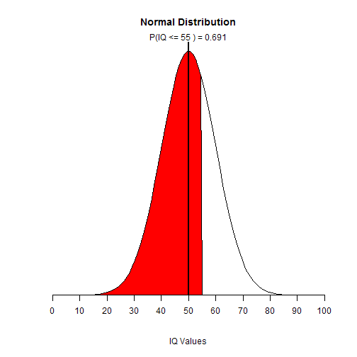

## Agenda
  This app is for normal distribution
  1. Input description
  2. Output description
  3. Overall

--- .class #id 

## Input

  The first input is for the population mu which range from -100 to 100 with step=1
  The second input is for the standard deviation which range from 0.1 to 20 with step=1
  The third slider is for the p value which range from -2 to 2

--- .class #id

## output

  For mu=50, sd=10, p=0.5, we can get the P(x < 55) = 0.691
  
  
 

--- &interactive

## Overall
  You can view the <a href="https://testcourse.shinyapps.io/homework/">application</a> 
  <a href="https://testcourse.shinyapps.io/homework/">https://testcourse.shinyapps.io/homework/</a>

